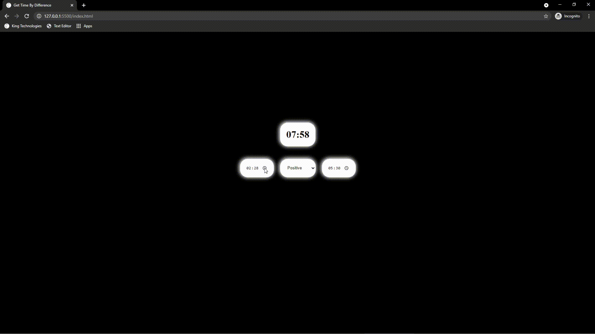

<p align="center">
  <a href="https://rohit19060.github.io/World-Clock-Converter/" title="World Clock Converter">
    
  </a>
</p>
<h1 align="center">🌟 World Clock Converter 🌟</h1>
<p align="center">App for getting time-based on difference, suppose you want to know at the particular time what time will be on other countries. Then just get the difference in time and put in it. You will have the time.</p>

<p align="center">
<a href="https://github.com/Rohit19060/World-Clock-Converter/blob/master/LICENSE" title="License">

</a>
<a href="https://github.com/Rohit19060/World-Clock-Converter/fork" title="Forks">

</a>
<a href="https://github.com/Rohit19060/World-Clock-Converter/stargazers" title="Stars">

</a>
<a href="https://github.com/Rohit19060/World-Clock-Converter/issues" title="Issues">

</a>
<a href="https://github.com/Rohit19060/World-Clock-Converter/pulls" title="Pull Requests">

</a>
<a href="https://github.com/Rohit19060/World-Clock-Converter" title="Repo Size">

</a>
<a href="https://discord.gg/2wpHNSjwm2" title="Join King Tech's Community">

</a>
</p>

<p align="center" title="World Clock Converter"></p>

<h2 align="center">🌐 Links 🌐</h2>
<p align="center">
    <a href="https://github.com/Rohit19060/World-Clock-Converter" title="World Clock Converter Repo">📂 Repo</a>
    ·
    <a href="https://rohit19060.github.io/World-Clock-Converter/" title="Visit">✨ Live View</a>
    ·
    <a href="https://github.com/Rohit19060/World-Clock-Converter/issues/new/choose" title="🐛Report Bug/🎊Request Feature">🚀 Got Issue</a>
</p>

## 🚀 Features

- **Get the Time Based on Different**

- **Very Simple and Minimalistic design**

## 🦋 Prerequisite

- Basic Understanding of [HTML](https://youtu.be/JHv2jmnrLlA "HTML - First Step Towards Web Development")

- Basic Understanding of [CSS](https://youtu.be/d1tP7ow7HbQ "CSS - Second Step Towards Web Development")

- Basic Understanding of JavaScript

## 🛠️ Installation Steps

1. Clone the repository

```Bash
git clone https://github.com/Rohit19060/World-Clock-Converter.git
```

2. Change the working directory

```Bash
cd World-Clock-Converter
```

**🎇 You are Ready to Go!**

## ❗ Available Commands

Run the index file on any server or in any browser.

## 👷 Built with

- [HTML](https://youtu.be/JHv2jmnrLlA "HTML - First Step Towards Web Development"): For Creating Markup

- [CSS](https://youtu.be/d1tP7ow7HbQ "CSS - Second Step Towards Web Development"): For Designing

- JavaScript: For Writing logic in the script

## 📂 Directory Structure

> [`index.html`](https://github.com/Rohit19060/World-Clock-Converter/blob/main/index.html "World Clock Converter"): Main file of the app

## 🎊 Future Updates

- [ ] Add difference directly based on country

## 🧑🏻 Author

**Rohit Jain**

- 🌌 [Profile](https://github.com/Rohit19060 "Rohit Jain")

- 🏮 [Email](mailto:rohitjain19060@gmail.com?subject=Hi%20from%20World%20Clock%20Converter "Hi!")

- 🦁 [Website](https://kingtechnologies.in "Welcome")

<h2 align="center">🤝 Support</h2>

<h3 align="center">🎀 Contributions (<a href="https://guides.github.com/introduction/flow" title="GitHub flow">GitHub Flow</a>), 🔥 issues, and 🥮 feature requests are most welcome!</h3>

<h3 align="center">💙 If you like this project, Give it a ⭐ and Share it with friends!</h3>
<h3 align="center">💰 Donations Links</h3>
<p align="center">
<a href="https://www.paypal.me/kingrohitJ" title="PayPal"></a>
<a href="https://www.buymeacoffee.com/rohitjain" title="Buy me a Coffee"></a>
<a href="https://ko-fi.com/rohitjain" title="Ko-fi"></a>
</p>

<p align="center">Made with JavaScript & ❤️ in India</p>
